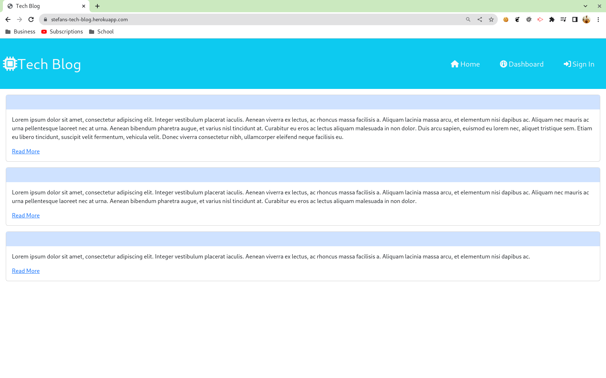
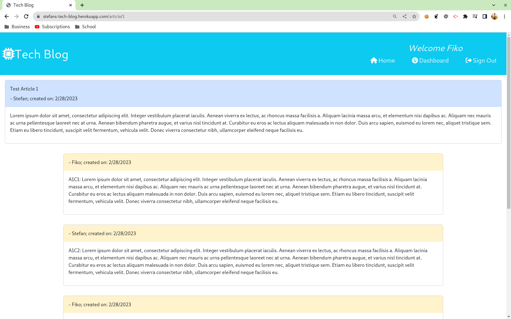
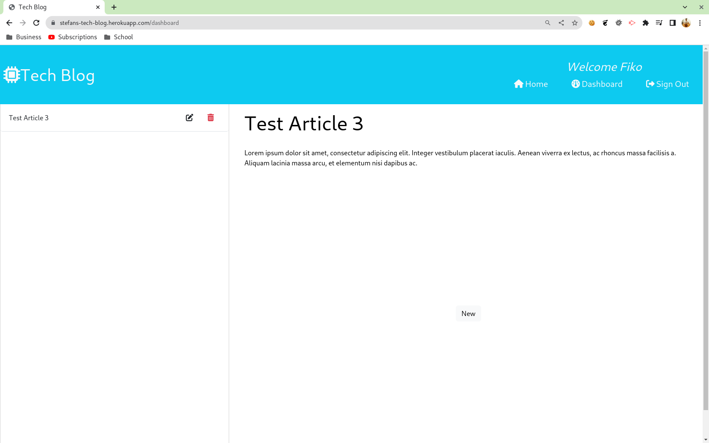

# UTOR-MOD14-CHAL01-Tech-Blog
University of Toronto - Module 14 - Challenge 01 - Tech Blog

## Description

Repository containing the code for the TechBlog application. This is a full stack application that presents the user with ways to communicate with each other regarding technical topics. At the front-end of the application, the user can see a listing or articles once the user lands on the page. Upon loggin in, the user is greeted with "Welcome user" on the banner, and the user can see more information on the the article listing. 

Upon clicking on the read more, the user is taken to the particular article with all comments that exist on the article. The user can also add a comment of their own using the form provided. To minimize bad data, the add button is displayed only after the user has entered 15 characters into the field.

The dashboard provides the user a way to keep track and mainting the user's articles. The user can see a listing of their atricles, edit existing articles, or add new ones. Just like the comment section, to minimize bad data, the add button is displayed only after the user has entered 15 characters into the article text field. 

At the back-end, the application stores all information in SQL database and uses custom built API's to access, update, and delete data. The user log in time is limited to 60 minutes after which, the user needs to log back in to make any edits

Below is the image of the application when a user arrives at the page.

Below is the image of an article and its comments after user has logged in.

Below is the image of the application when the user accesses the dashboard

## Table of Contents

- [Installation](#installation)
- [Functionality](#functionality)
- [Usage](#usage)
- [Credits](#credits)
- [Tests](#tests)
- [License](#license)
- [Walktrough](#walkthrough)
- [Future Development](#future-development)

## Installation

No installation requirements. Simply visit https://stefans-tech-blog.herokuapp.com/ to view the application

back to [Table of Contents](#table-of-contents)

## Functionality

The following discusses at a high level about some of the features of the website. Detailed code implementation can be found as comments in the JS files.

### Node.js:

The entire porject is built on Node.js utilizing the following additional libraries:
- sequalize: this librabry handles all communication between the application and the database. The library makes use of Javascript objects, which subsequently translates to SQL stataments to perform database operations.
- dotenv: this 'hides' the sensitive information such as database user names and passwords into a hidden file named .env. The file is added to the process variables which are used by sequalize to establish database connection.
- express-session: this stores the session data including items like the user name and user id when the user logs in.
- handlebars: this is the template engine that is responsible for rendering all the data on the page. Several templates are used and several partials are used to fill repretitive data.

### Bootstrap, jQuery, and FontAwesome

The project relies on the bootstrap framework to handle all elements and their responsiveness on the various devices. 

jQuery is used for all browser related JavaScript code to access and update elements. 

Font awesome handles the additional graphics on the website.

back to [Table of Contents](#table-of-contents)

## Usage

1. Go to https://stefans-tech-blog.herokuapp.com/
2. Click on Sign-in icon at the top
    1. for existing users, enter your email and password
    2. for new users, click the "register" button and fill the information on the form
3. To view an article and its comments, click on the Read More link.
    1. to add a comment to an article, enter your comment and click on the "Add" button
4. To access your own articles, click on the dashboard link
    1. to add a new article, fill in the title and the text and click the save button
    2. to view/update an existing article, click on the pencil icon beside the article title
    3. to delete an existing artice, click on the garbage can beside the article title

back to [Table of Contents](#table-of-contents)

## Credits
n/a

back to [Table of Contents](#table-of-contents)

## Tests

All tests have been performed manually.

back to [Table of Contents](#table-of-contents)

## License

Please refer to the LICENSE in the repo.

back to [Table of Contents](#table-of-contents)

## Walkthrough

This app is a hands on app where the user can interact with it. No video walkthrough is necessary.

back to [Table of Contents](#table-of-contents)

## Future Development

Here are some of the items to be considered for future development.
1. Find a way to color the user's own comments on articles in a different colour

back to [Table of Contents](#table-of-contents)
